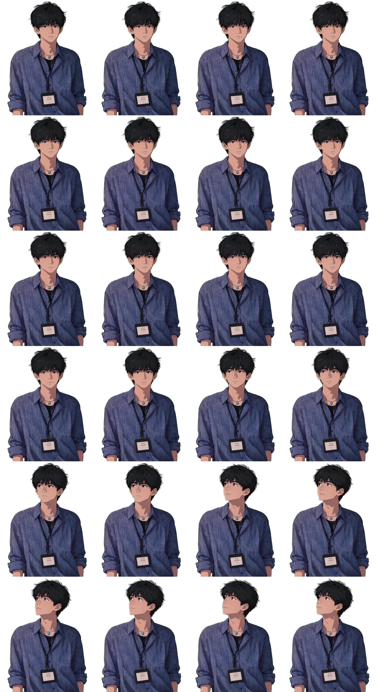
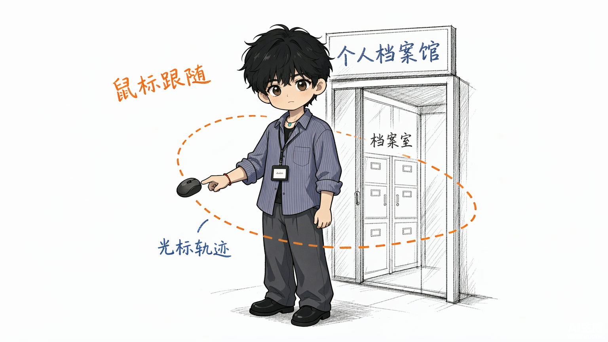
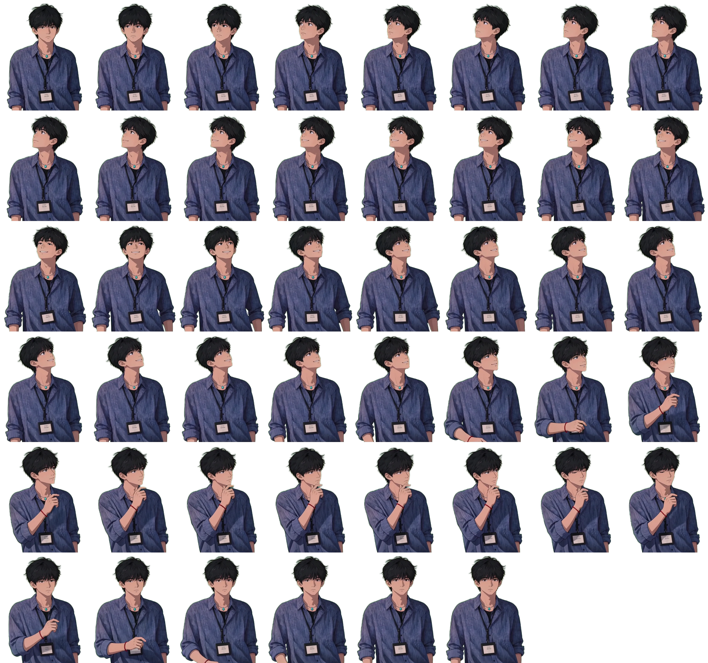
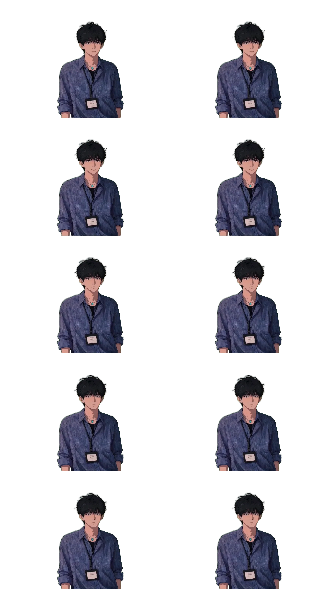
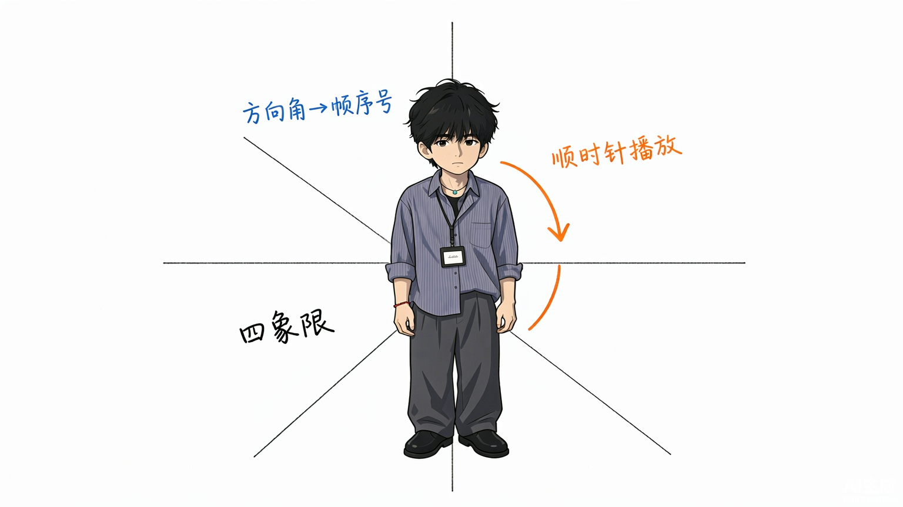
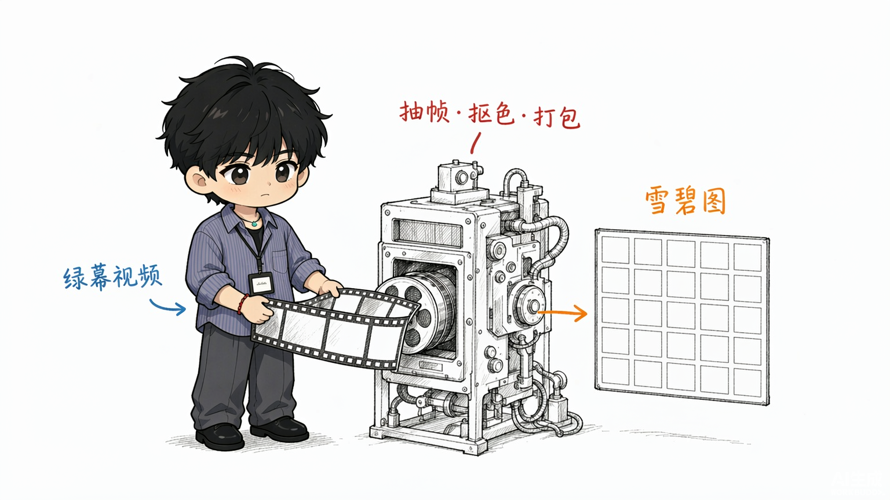
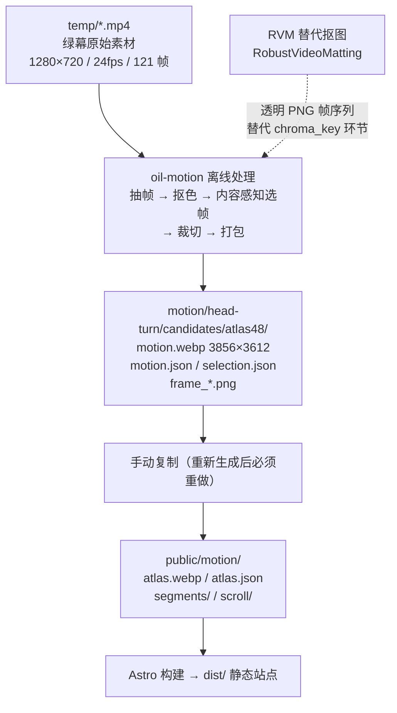
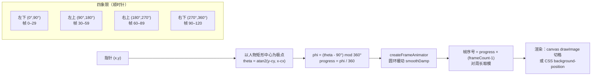

<p align="center">  
    
</p>

<h1 align="center">个人档案馆 · Personal Archive</h1>

<p align="center">  
  一个以「鼠标跟随的动态人物立绘」为核心的个人网站：求职 + 博客 + 作品集 + 实验室。  
    
  
  绿幕视频 → 抽帧 → 抠色 → 雪碧图，用光标方向驱动人物转身。  
</p>

<p align="center">  
  <a href="https://iam.daidai.click" target="\_blank">  
      
  </a>  
  <a href="https://github.com/daidai/iam-daidai/issues" target="\_blank">  
      
  </a>  
  <a href="https://github.com/daidai/iam-daidai/issues" target="\_blank">  
      
  </a>  
</p>

<p align="center">  
    
    
    
    
    
</p>

---

<details>  
  <summary>目录 · Table of Contents</summary>  
  <ol>  
    <li><a href="#about-the-project">关于项目 · About The Project</a>  
      <ul>  
        <li><a href="#screenshots">效果与素材图 · Screenshots</a></li>  
        <li><a href="#built-with">技术栈 · Built With</a></li>  
      </ul>  
    </li>  
    <li><a href="#getting-started">快速开始 · Getting Started</a>  
      <ul>  
        <li><a href="#prerequisites">环境要求 · Prerequisites</a></li>  
        <li><a href="#installation">安装 · Installation</a></li>  
      </ul>  
    </li>  
    <li><a href="#usage">使用 · Usage</a>  
      <ul>  
        <li><a href="#commands">常用命令 · Commands</a></li>  
        <li><a href="#the-interaction">交互机制 · The Interaction</a></li>  
      </ul>  
    </li>  
    <li><a href="#architecture">架构 · Architecture</a>  
      <ul>  
        <li><a href="#two-layers">两层结构 · Two Layers</a></li>  
        <li><a href="#asset-pipeline">素材流水线 · Asset Pipeline</a></li>  
        <li><a href="#frame-follow">帧随动原理 · Frame-Follow</a></li>  
      </ul>  
    </li>  
    <li><a href="#roadmap">路线图 · Roadmap</a></li>  
    <li><a href="#contributing">贡献 · Contributing</a></li>  
    <li><a href="#license">许可证 · License</a></li>  
    <li><a href="#contact">联系方式 · Contact</a></li>  
    <li><a href="#acknowledgments">致谢 · Acknowledgments</a></li>  
  </ol>  
</details>

---

## 关于项目 · About The Project

<p align="center">  
    
    
  
  <sub>121 帧分段雪碧图（6 段之一，4×6 = 24 格）。运行时按需解码、LRU 只驻留当前段 ± 环形邻段。</sub>  
</p>

「个人档案馆」是一个**零运行时框架依赖**的个人站点：

- 主页 hero 是一个**鼠标跟随的动态人物立绘**——把一段绿幕视频抽帧、抠色、打包成雪碧图，用光标相对人物的**方向角**驱动帧序号，绕人物顺时针划一圈即完整播放一遍动作。
- 向下滚动 / 触摸纵向拖动时，人物在原位**原地换血**为 193 帧滚动素材（scroll-scrub），与 hero 同一人物位、墨迹尺度对齐，切入切出无跳变。
- 四个板块：基本信息 / 作品集 / 博客中心 / 实验室，由一个扇形档案卡片矩阵承载全站导航。
- 纯静态输出：`dist/` 可直接托管到 Cloudflare Pages，无常驻 Node 进程；站内全文检索由 Pagefind 在构建钩子里生成。

选择这套方案的核心理由：

- **Alpha 通道零损失**——抠色在离线阶段烤入 WebP，运行时不做任何像素运算，不存在浏览器间 shader 精度差异。
- **运行时零依赖**——不需要 WebGL 上下文、不需要视频 seek 时序协调，只写一个 CSS 属性 / 一次 `drawImage`。
- **体积可控**——121 帧分段图集约 3.9 MB，回退的 46 帧单图仅 1.16 MB。

> 完整推导见仓库内 `优化思路说明.md`（含硬上限推导、抽帧方案对比表、包围盒测算）。

<p align="center">
  
  <br />
  <sub>Q版 daidai 演示核心交互：光标绕着人物转，方向角驱动帧序号。</sub>
</p>

### 效果与素材图 · Screenshots

| 素材                                                                              | 说明                                                                                            |
| ------------------------------------------------------------------------------- | --------------------------------------------------------------------------------------------- |
|               | **46 帧单图雪碧图（回退路径）**：8×6 网格、单格 482×602、内容感知选帧。纯 CSS `background-position` 百分比切图，已 46/46 像素级验证。 |
|    | **121 帧分段图集（主路径）**：6 段 × 4×6 格，canvas `createImageBitmap` 按需解码 + LRU 邻段预取。                    |
|  | **滚动素材（scroll-scrub）**：193 帧，滚轮 / 触摸纵向拖动驱动，与 hero 人物墨迹对齐。                                     |
|         | **基本信息头像**：图集 f0 正脸帧裁切的透明底素材，用于 #basic 抽屉。                                                    |

### 技术栈 · Built With

- [Astro](https://astro.build/) — 零 JS 静态输出，唯一交互岛通过 `<script>` 加载
- [Pagefind](https://pagefind.app/) — 纯静态全文检索，挂在 `astro:build:done` 钩子
- [@astrojs/sitemap](https://docs.astro.build/en/guides/integrations-guide/sitemap/) — 站点地图
- Canvas API + WebP alpha-atlas — 雪碧图渲染
- 部署：Cloudflare Pages（静态）+ Cloudflare Worker（联系表单，无站点明文邮箱）

---

## 快速开始 · Getting Started

要把项目跑起来，只需 Node 与 npm。素材（雪碧图）已随仓库置于 `public/motion/`，无需重新生成即可开发。

### 环境要求 · Prerequisites

- Node.js ≥ 18（开发用 24.x 验证过）
- npm（随 Node 自带）

```bash
node --version
npm --version
```

### 安装 · Installation

1. 克隆仓库
   ```bash
   git clone https://github.com/daidai/iam-daidai.git
   cd iam-daidai
   ```
2. 安装依赖
   ```bash
   npm install
   ```
3. 启动开发服务器
   ```bash
   npm run dev -- --port 8888
   ```
   打开 `http://localhost:8888`，移动鼠标即可看到人物跟随转身。

---

## 使用 · Usage

### 常用命令 · Commands

| 命令                  | 作用                                       |
| ------------------- | ---------------------------------------- |
| `npm run dev`       | 启动开发服务器（默认 4321，可用 `-- --port 8888` 改端口） |
| `npm run build`     | 构建到 `dist/`（纯静态，含 Pagefind 索引）           |
| `npm run preview`   | 本地预览构建产物                                 |
| `npm run qa:follow` | 帧随动 + 卡片视差回归测试（指针 → 帧序号映射契约）             |
| `npm run qa:touch`  | 触摸 / 滚动 scrub 回归测试                       |

> **受限环境提示**：若构建报 `EACCES: /root/.config/astro`，先设 `export ASTRO_TELEMETRY_DISABLED=1`；若 safe-delete 护栏拦截 `dist/` 清理，先手动清空 `dist/` 再构建（`find dist -mindepth 1 -maxdepth 1 -exec rm -rf {} + && npm run build`）。详见 `CODEBUDDY.md`。

### 交互机制 · The Interaction

<p align="center">
  
  <br />
  <sub>Q版 daidai 演示：以人物矩形中心为极点，光标方向角分四象限决定帧序号。</sub>
</p>

- **鼠标移动** → hero 121 帧指针跟随（`demo-driver.js`，方向角分四象限的圆环缓动）。
- **滚轮 / 触摸纵向拖动** → 193 帧滚动素材原地 scrub（`scroll-scrub.js`，与 hero rest 按墨迹尺度对齐）。
- 指针监听挂在 `window` 上（而非舞台元素），所以光标移到视口四角、或被卡片压住的区域时仍持续跟随。

```bash
# 完整动作序列：把指针绕人物顺时针划一圈，即按顺序播放全部帧
# 左下 → 左上 → 右上 → 右下，接缝落在人物正下方的竖线
```

---

## 架构 · Architecture

### 两层结构 · Two Layers

仓库里是**两层完全不同的东西**，改代码前必须分清：

| 层            | 位置                                  | 性质           | 是否参与构建                  |
| ------------ | ----------------------------------- | ------------ | ----------------------- |
| **Astro 前端** | `src/`、`public/`、`astro.config.mjs` | 手写源码，日常开发对象  | ✅ 是                     |
| **素材生成流水线**  | `motion/`、`temp/`                   | 离线产出的中间产物与母版 | ❌ 否（tsconfig 已 exclude） |

`motion/` 和 `temp/` **不是源码，是素材仓库**。重跑流水线后必须手动把产物复制进 `public/motion/`——`public/` 下的是副本。

### 素材流水线 · Asset Pipeline

<p align="center">
  
  <br />
  <sub>Q版 daidai 演示素材流水线：绿幕视频经抽帧、抠色、打包成雪碧图。</sub>
</p>



### 帧随动原理 · Frame-Follow

`src/lib/pointer-frame.js` 是唯一实现，把光标坐标映射成帧进度：



**为什么用角度而不是 x 比例**：方向角天然把页面按极点切成左下/左上/右上/右下四块，且给出象限内的单调插值；只用 x 比例会丢掉 y 维度（同一列上下同帧），且指针移到视口四角时被 clamp 到两端。帧序被当作**周长 = frameCount 的圆环**，接缝处的 target 跳变通过「差值回绕到最短路径」避免倒扫整段帧序。

---

## 路线图 · Roadmap

- [x] 鼠标跟随的动态人物立绘（121 帧分段图集）
- [x] 滚动 / 触摸原地 scrub（193 帧）
- [x] 扇形档案卡片全站导航 + 基本信息抽屉
- [x] Pagefind 站内检索 + sitemap
- [x] Cloudflare Pages 部署 + Worker 联系表单（页面零邮箱明文）
- [ ] 作品集 / 实验室内容填充
- [ ] 移动端版式细化与更多触摸手势
- [ ] 多语言支持（中 / 英）

---

## 许可证 · License

本项目基于 [MIT License](LICENSE) 开源。

---

## 联系方式 · Contact

- Me：[iam.daidai.click](https://iam.daidai.click)
- GitHub：<https://github.com/coconuttree0730>
- RSS：[iam.daidai.click/rss.xml](https://iam.daidai.click/rss.xml)

> 合作或想法，请通过站内联系表单留言（页面不展示任何邮箱明文，来信仅存于站长邮箱）。

---

## 致谢 · Acknowledgments

- [Best-README-Template](https://github.com/othneildrew/Best-README-Template) — 本 README 的骨架与写法参考
- [Astro](https://astro.build/) — 静态站点框架
- [Pagefind](https://pagefind.app/) — 静态检索
- [oil-motion](https://github.com/) — 雪碧图素材生成流水线（抽帧 / 抠色 / 打包）
- [RobustVideoMatting](https://github.com/PeterL1n/RobustVideoMatting) — AI 抠图替代方案
- [Img Shields](https://shields.io/) — README 徽章

<p align="right">(<a href="#about-the-project">回到顶部 ↑</a>)</p>
